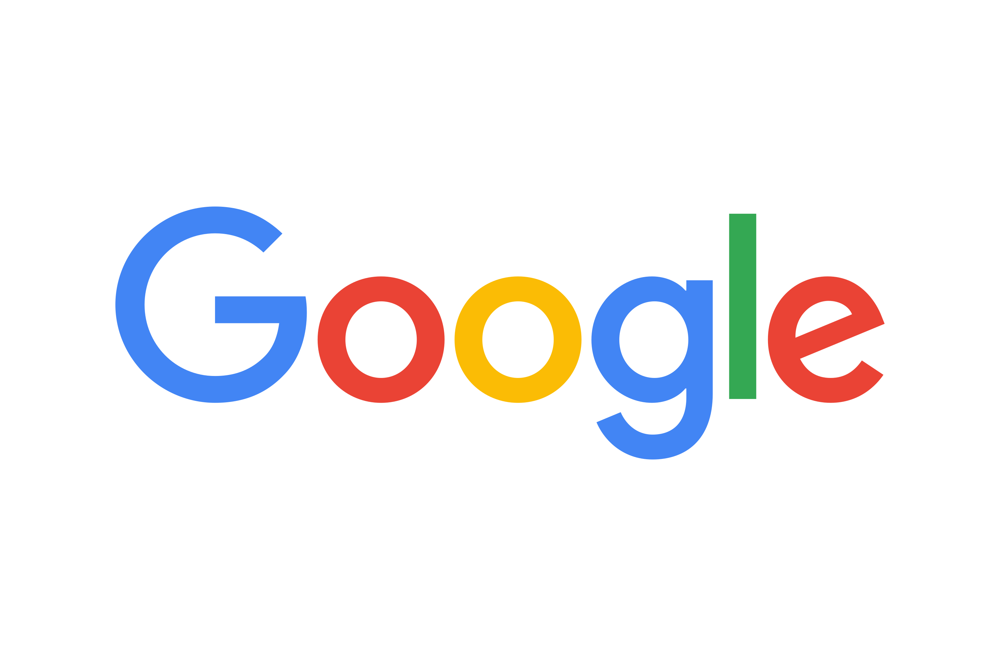

{.lightbox fig-align="center" width="50%"}

I was happy to receive a Software Engineering (SWE) internship offer from Google’s **Tech Infrastructure Development** team for Summer 2026. I received the offer after successfully completing two technical interviews and passing the team-matching round.

I’m grateful for the opportunity and for everyone who supported me throughout the interview and recruiting process. It was a great experience that challenged me technically and gave me the chance to learn more about engineering at Google.