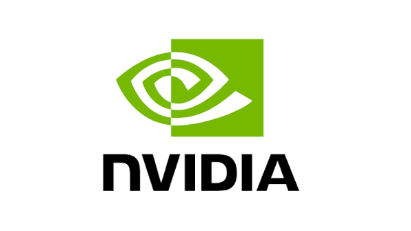

{.lightbox fig-align="center" width="50%"}

I was happy to receive a Deep Leaning Software Engineering internship offer from NVDIA’s **cuDNN/FlashInfer** team for Summer 2026. I received the offer after successfully completing two technical interviews.

I’m grateful for the opportunity and for everyone who supported me throughout the interview and recruiting process. It was a great experience that challenged me technically and gave me the chance to learn more about engineering at Google.