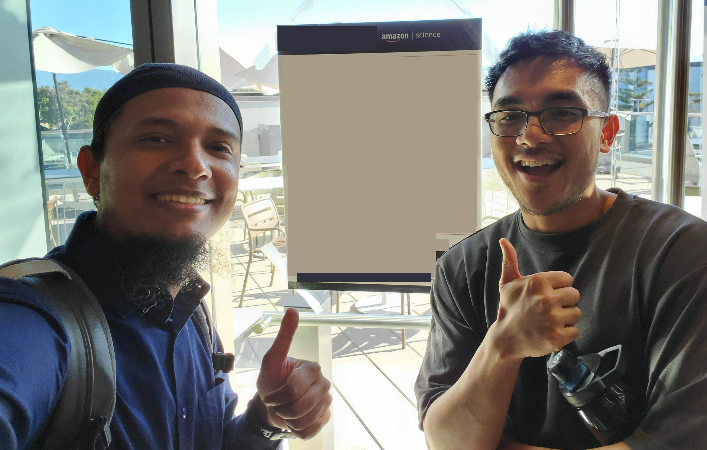

::: {.callout-note appearance="minimal" title="Note" icon="false" collapse="false"}
Amazon AWS Internship Summer 2025
:::

{.lightbox}

## Overview

Developed a robust, end-to-end differentiable GPU kernel autotuner LLM inference.