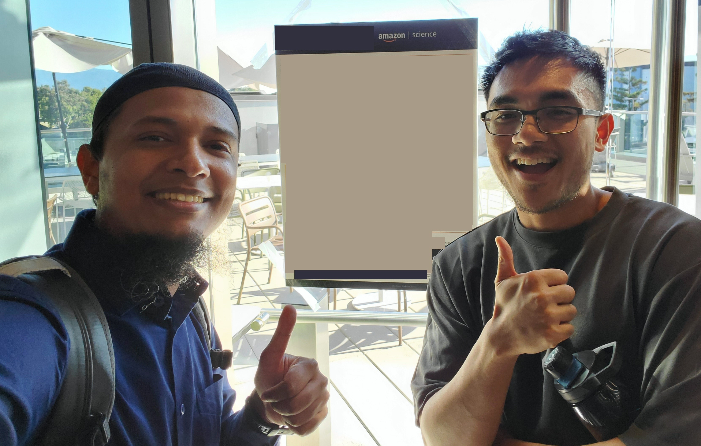

::: {.callout-note appearance="minimal" title="Note" icon="false" collapse="false"}
Amazon AWS Internship Summer 2025
:::

{.lightbox}

## Overview

Developed a robust, end-to-end differentiable GPU kernel autotuner for Mixture of Experts (MoE) kernels that works well with as low as 1% ground truth of the total search space (around 50k possible candidates). The solution also performs transfer learning and can leverage cheaper kernel tuning data to reduce new kernel tuning time fro

## Findings

-   Across six datasets, our auto-tuner obtained an improvement in cross-validation accuracy of 0.85× − 1.60× compared to 16 other ML and tabular transformer models (commonly used for performance modeling) on 1% ground truth. Accuracy continued to improve and outperformed all baselines as the training data increased.

-   In transfer learning, up to 12.7% accuracy improvement was observed when an expensive CUDA MoE kernel was tuned using only 100 config-perf pairs and leveraged with similar and cheaper Triton kernel’s tuning data.